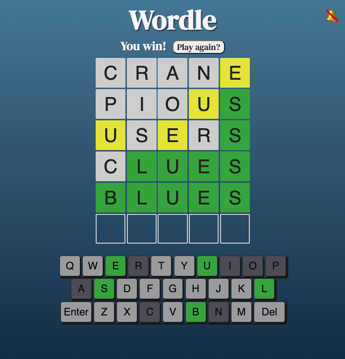

# Wordle

A word-based game that tasks players with guessing a secret 5 letter word in 6 turns or fewer. Each guess tells you how close - or far - you are from the correct word.

Many people enjoy Wordle, but a common complaint is that it can only be played once a day. Now it can be played as often as desired, at any degree of difficulty!

## [Play Wordle Here!](https://mjlueder-wordle.netlify.app/)

[Initial Pseudocode](https://docs.google.com/document/d/1At54uKUE_zaxnbRbwbDsyeQSDajZy5GxDtSSkdS1XJ0/edit?usp=sharing)

## Technologies used

### Must-Haves 💻
* Render a game in the browser. You may not use Canvas or jQuery.
* Include win/loss logic and render win/loss messages in HTML.
* Include separate HTML, CSS, JavaScript, and JavaScript Data files.
* Display a favicon.
* Use CSS Flexbox or Grid.
* Look and feel similar to apps we use daily 
* Have no remaining dead or commented out code, or console logs.
* Be coded using proper indentation.
* Be coded using function and variable names that make sense and follow standard conventions 
* Must use a separate data file for the word list

### Added Features ✨
* Mobile-first design
* Tile animations for letter reveal, wins, and non-word rejections
* Sound effects on tile flip
* A mute button for sound effects
* User can choose a difficulty level, including a "surprise me" option
* "Play Again" feature

### Icebox Items 🧊 
- [ ] Light/Dark Mode
- [ ] Score tracker using localStorage
- [ ] Create an instruction page for players new to Wordle
- [ ] Automatically generate an answer if a user starts typing before choosing a difficulty level
- [ ] Redo animations to remove animation classes with animationend event listeners immediately after they are run
- [ ] Change keyboard color-coding to match delay of tile flips

### Known Issues 🔧
* Sound inconsistent on some devices/browsers

### Attributions:
* Tile animations: [Animate.style](https://animate.style/)
* DM Serif Display: [Google Fonts](https://fonts.google.com/specimen/DM+Serif+Display?query=dm+serif)
* Sound effect: [FreeSound](https://freesound.org/people/Cornersting/sounds/317448/)
* Favicon: [VectorStock](https://www.vectorstock.com/royalty-free-vector/logo-letter-w-blue-glowing-vector-22855325)
* Markdown Badges: [GitHub](https://github.com/Ileriayo/markdown-badges)

